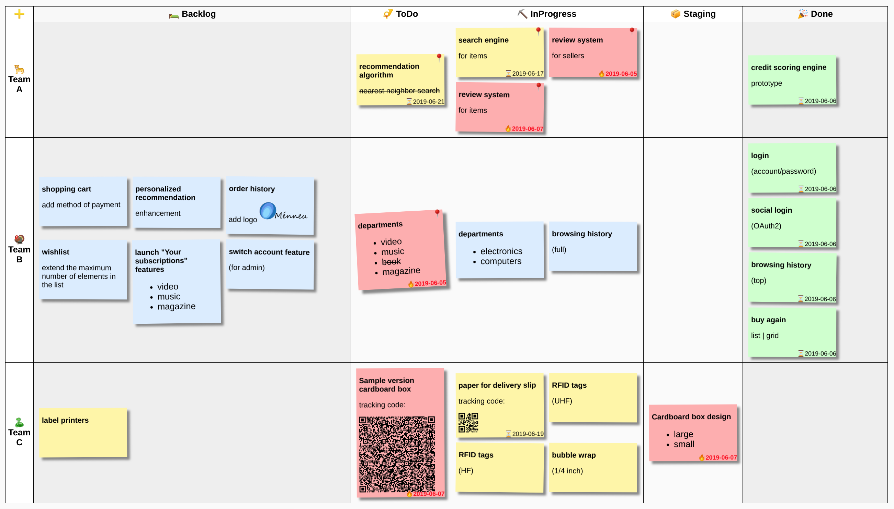
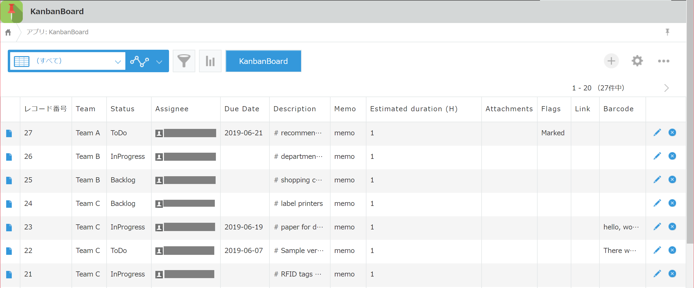

# Kanban Board for [Ménneu Reporting App for kintone](https://github.com/shellyln/menneu-reporting-app-for-kintone)


## 📍 Features

* Markdown kanban body text
* Due date
* Customizable `status` and `teams`/`stories`
* Show QR code


## 🖼 Gallery

### Kanban board


### List view


## 💻 Requiments
* [Ménneu Reporting App for kintone](https://github.com/shellyln/menneu-reporting-app-for-kintone)
* kintone (>=Professional:en / >=Standard:jp)
* browser
  * Google Chrome: latest
  * Firefox: latest


------------------------


## 🔶 Kanban Board App (App that uses the ReportingApp)


### Fields

|Field Code        |Caption    |Value                                                 |Type        |Required|
|------------------|-----------|------------------------------------------------------|------------|--------|
|**team_or_story** |Team       |Team A, Team B, Team C                                |Dropdown    |X       |
|**status**        |Status     |Backlog, ToDo, InProgress, Staging, Done, Archived, Rejected|Dropdown|X     |
|assignee          |Assignee   |                                                      |UserSelect  |        |
|**due_date**      |DueDate    |                                                      |Date        |        |
|**flags**         |Flags      |Marked                                                |Checkboxes  |        |
|**description**   |Description|                                                      |Textarea    |X       |
|memo              |Memo       |                                                      |Textarea    |        |
|**barcode**       |Barcode    |                                                      |Textarea    |        |
|estimated_duration|Estimated duration (H)|                                           |Textbox     |        |
|link              |Link       |                                                      |Textbox     |        |
|attachments       |Attachments|                                                      |Attachements|        |
|作成者|作成者||creator|X|
|作成日時|作成日時||createdDt|X|
|更新者|更新者||modifier|X|
|更新日時|更新日時||updatedDt|X|

> **bold** : Use from report.

### JS and CSS
#### JS (PC, Mobile)
* https://unpkg.com/react@16/umd/react.production.min.js
* https://unpkg.com/react-dom@16/umd/react-dom.production.min.js
* [menneu.min.js](https://shellyln.github.io/releases/menneu/0.1.0/menneu.min.js)
  * **Please do not register the above URL directly. It is not a CDN URL.**
* app-buttons.js
  * Please edit this file to show the button of the defined report.
    * `eXnhAMYWrBVFMczJ__REPORT_APP_ID`: ReportingApp's app id.
    * `eXnhAMYWrBVFMczJ__REPORT_BUTTONS`: Report definition record ids you want to use in this app.
* kintone-report-buttons.js

#### CSS
* [51-modern-default.css](https://github.com/kintone/plugin-examples/blob/master/stylesheet/51-modern-default.css)
  * **Please do not register the above URL directly. It is not a CDN URL.**


------------------------


## 📑📊 ReportingApp (帳票テンプレート App)
### Report definition
#### Report for list view (for multiple records)
##### Report_name
* KanbanBoard

##### Switches
* Scripting, LSX, List

##### Report_template (lisp LSX scripting)

###### kanban-board.lsx.lisp
```lisp
;; Report configurations
...

    ;; Set status to show
    ($let status-list ($list
        (# (value "Backlog")
           (caption "🛌 Backlog")
           (class "status-backlog") )
        (# (value "ToDo")
           (caption "📯 ToDo")
           (class "status-todo") )
        (# (value "InProgress")
           (caption "⛏ InProgress")
           (class "status-inprogress") )
        (# (value "Staging")
           (caption "📦 Staging")
           (class "status-staging") )
        (# (value "Done")(done)
           (caption "🎉 Done")
           (class "status-done") )))

    ;; Set teams or stories to show
    ($let team-or-story-list ($list
        (# (value "Team A")
           (caption "🐆 Team A")
           (class "team-or-story-team-a") )
        (# (value "Team B")
           (caption "🦃 Team B")
           (class "team-or-story-team-b") )
        (# (value "Team C")
           (caption "🐍 Team C")
           (class "team-or-story-team-c") )))

    ;; Set your kintone environment domain and app id
    ($let record-url-base "https://??????????.cybozu.com/k/15/")

...

    /* Customize row|col|sticky color */
    table.board thead th.status-backlog {
        background-color: #f8f8f8;
    }
    table.board td.status-backlog {
        background-color: #efefef;
    }
    table.board thead th.status-done {
        background-color: #f8f8f8;
    }
    table.board td.status-done {
        background-color: #efefef;
    }

    ...

    .sticky-note { ... }

    ...

    .team-or-story-team-b .sticky-note {
        background-color: #dbedff;
    }

...
```

------------------------


# ⚖️ License
* MIT

Copyright (c) 2019 Shellyl_N

